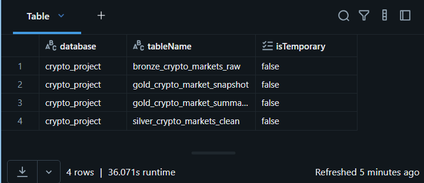
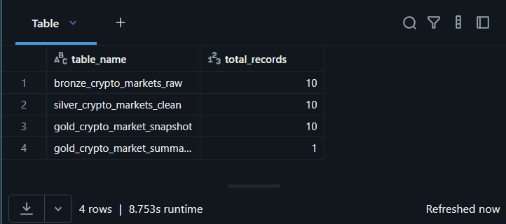
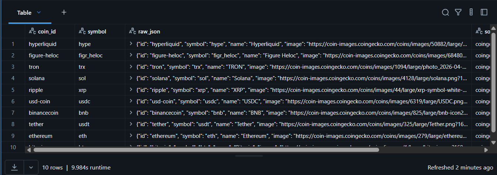
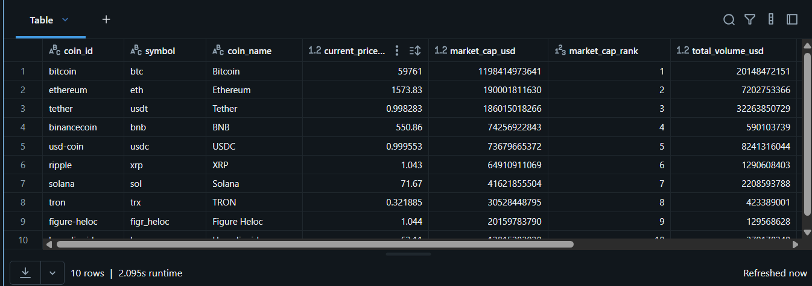
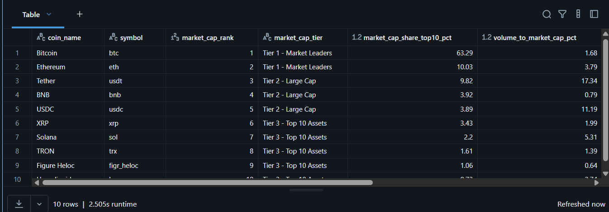
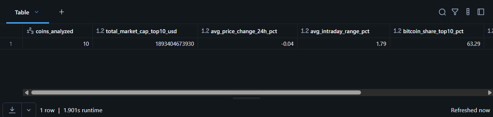
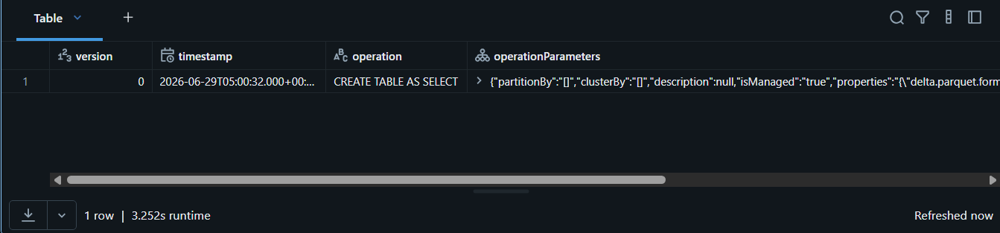

# Crypto Market Analytics Platform — Databricks Medallion Architecture

## Project Overview

This project implements an end-to-end data engineering pipeline using **Databricks Free Edition**, **Apache Spark**, **PySpark**, **Spark SQL**, and **Delta Lake**.

The pipeline ingests real cryptocurrency market data from the **CoinGecko Public API**, stores the raw API response in a **Bronze Delta table**, transforms and structures the data into a **Silver Delta table**, and creates analytics-ready business KPIs in the **Gold layer**.

The main goal of this project is to demonstrate practical data engineering skills using the **Medallion Architecture**, including API ingestion, raw data preservation, schema enforcement, data transformation, Delta Lake versioning, and business-level analytics.

---

## Architecture

```text
CoinGecko Public API
        |
        v
+-----------------------------+
| Bronze Layer                |
| Raw API ingestion           |
| Delta Table                 |
+-----------------------------+
        |
        v
+-----------------------------+
| Silver Layer                |
| Cleaned and typed data      |
| Delta Table                 |
+-----------------------------+
        |
        v
+-----------------------------+
| Gold Layer                  |
| Business KPIs and summary   |
| Delta Tables                |
+-----------------------------+
```

### Final Pipeline

```text
CoinGecko API
     |
     v
crypto_project.bronze_crypto_markets_raw
     |
     v
crypto_project.silver_crypto_markets_clean
     |
     v
crypto_project.gold_crypto_market_snapshot
crypto_project.gold_crypto_market_summary
```

---

## Business Problem

A business or analytics team may want to monitor the top cryptocurrency assets by market capitalization, understand their short-term price performance, evaluate liquidity, compare volatility, and identify market leaders.

This project simulates a small but realistic data platform that prepares crypto market data for dashboards, reporting, and decision-making.

The Gold layer answers questions such as:

* Which cryptocurrencies dominate the top 10 market capitalization ranking?
* Which assets had positive or negative 24-hour performance?
* Which coins show higher intraday volatility?
* Which assets have stronger relative trading volume?
* Which coins have a reported maximum supply?
* What is the total market capitalization of the analyzed top 10 assets?

---

## Technologies Used

* Databricks Free Edition
* Apache Spark
* PySpark
* Spark SQL
* Delta Lake
* Unity Catalog basic structure
* CoinGecko Public API
* GitHub
* Databricks Git Folder integration

---

## Repository Structure

```text
crypto-market-analytics-databricks/
│
├── README.md
│
├── notebooks/
│   ├── 01_bronze_ingestion.ipynb
│   ├── 02_silver_transformation.ipynb
│   └── 03_gold_business_kpis.ipynb
│
├── images/
│   ├── show_tables.png
│   ├── table_counts.png
│   ├── bronze_table.png
│   ├── silver_table.png
│   ├── gold_snapshot.png
│   ├── gold_summary.png
│   └── delta_history.png
│
└── docs/
    └── architecture.md
```

---

## Data Source

The data source used in this project is the **CoinGecko Public API**.

Endpoint used:

```text
https://api.coingecko.com/api/v3/coins/markets
```

Main API parameters:

```python
params = {
    "vs_currency": "usd",
    "order": "market_cap_desc",
    "per_page": 10,
    "page": 1,
    "sparkline": "false",
    "price_change_percentage": "24h"
}
```

The API returns market data such as:

* Coin ID
* Symbol
* Name
* Current price
* Market capitalization
* Market cap rank
* Total trading volume
* 24-hour high and low price
* 24-hour price change
* Circulating supply
* Total supply
* Maximum supply
* All-time high
* All-time low
* Last updated timestamp

---

## Medallion Architecture

This project follows the **Medallion Architecture**, which separates the data pipeline into three layers:

```text
Bronze → Silver → Gold
```

Each layer has a specific responsibility.

---

## Bronze Layer — Raw Ingestion

### Table

```text
crypto_project.bronze_crypto_markets_raw
```

### Purpose

The Bronze layer stores raw data exactly as it arrives from the source system.

In this project, the Bronze notebook calls the CoinGecko API and stores the raw JSON response in a Delta table without applying business transformations.

### Main Responsibilities

* Call the CoinGecko Public API.
* Store the raw JSON response.
* Preserve the original source data.
* Add ingestion metadata.
* Enable traceability and future reprocessing.

### Main Columns

| Column          | Description                            |
| --------------- | -------------------------------------- |
| `coin_id`       | Cryptocurrency identifier from the API |
| `symbol`        | Cryptocurrency symbol                  |
| `raw_json`      | Full raw JSON response for each coin   |
| `source_system` | Source system name                     |
| `api_endpoint`  | API endpoint used for ingestion        |
| `ingestion_ts`  | Timestamp when the data was ingested   |

### Write Mode

Bronze uses `append` mode.

```python
bronze_df.write \
    .format("delta") \
    .mode("append") \
    .saveAsTable("crypto_project.bronze_crypto_markets_raw")
```

### Why Append?

Each execution of the Bronze notebook represents a new ingestion batch. The goal is to preserve historical raw data instead of overwriting it.

---

## Silver Layer — Cleaned and Structured Data

### Table

```text
crypto_project.silver_crypto_markets_clean
```

### Purpose

The Silver layer transforms the raw JSON data into structured, typed, and analysis-ready columns.

This layer reads from Bronze, parses the `raw_json` field, extracts relevant attributes, applies data types, and adds a processing timestamp.

### Main Responsibilities

* Read from the Bronze Delta table.
* Parse the raw JSON response.
* Extract useful fields.
* Convert data types.
* Preserve source metadata.
* Prepare clean data for analytical transformations.

### Main Columns

| Column                        | Description                                  |
| ----------------------------- | -------------------------------------------- |
| `coin_id`                     | Cryptocurrency identifier                    |
| `symbol`                      | Cryptocurrency symbol                        |
| `coin_name`                   | Cryptocurrency name                          |
| `current_price_usd`           | Current price in USD                         |
| `market_cap_usd`              | Market capitalization in USD                 |
| `market_cap_rank`             | Ranking by market capitalization             |
| `total_volume_usd`            | Total trading volume in USD                  |
| `high_24h_usd`                | Highest price in the last 24 hours           |
| `low_24h_usd`                 | Lowest price in the last 24 hours            |
| `price_change_percentage_24h` | Percentage price change in the last 24 hours |
| `circulating_supply`          | Circulating supply                           |
| `total_supply`                | Total supply                                 |
| `max_supply`                  | Maximum supply if available                  |
| `last_updated_ts`             | Last update timestamp from the API           |
| `ingestion_ts`                | Original Bronze ingestion timestamp          |
| `silver_processed_ts`         | Silver processing timestamp                  |

### Write Mode

Silver uses `overwrite` mode.

```python
silver_df.write \
    .format("delta") \
    .mode("overwrite") \
    .option("overwriteSchema", "true") \
    .saveAsTable("crypto_project.silver_crypto_markets_clean")
```

### Why Overwrite?

Silver is a derived layer. If the transformation logic changes, the table can be rebuilt from Bronze.

---

## Gold Layer — Business KPIs

The Gold layer creates analytics-ready tables for dashboards, reporting, and business analysis.

### Tables

```text
crypto_project.gold_crypto_market_snapshot
crypto_project.gold_crypto_market_summary
```

---

## Gold Table 1 — Market Snapshot

### Table

```text
crypto_project.gold_crypto_market_snapshot
```

### Purpose

This table provides detailed business KPIs for each cryptocurrency in the top 10 market cap ranking.

### Main KPIs

| KPI                          | Description                                                                               |
| ---------------------------- | ----------------------------------------------------------------------------------------- |
| `market_cap_share_top10_pct` | Percentage contribution of each coin to the total market cap of the top 10 analyzed coins |
| `volume_to_market_cap_pct`   | Trading volume as a percentage of market capitalization                                   |
| `intraday_range_pct`         | Difference between 24h high and 24h low as a percentage of current price                  |
| `performance_signal`         | Classification of 24h price movement as Positive, Neutral, or Negative                    |
| `volatility_bucket`          | Volatility classification based on intraday price range                                   |
| `market_cap_tier`            | Business classification based on market cap rank                                          |
| `supply_issued_pct`          | Percentage of maximum supply already issued                                               |
| `supply_status`              | Supply classification based on max supply availability and issued percentage              |

### Example Business Logic

```python
.withColumn(
    "performance_signal",
    when(col("price_change_percentage_24h") >= 1, "Positive")
    .when(col("price_change_percentage_24h") <= -1, "Negative")
    .otherwise("Neutral")
)
```

```python
.withColumn(
    "volatility_bucket",
    when(col("intraday_range_pct") >= 5, "High Volatility")
    .when(col("intraday_range_pct") >= 2, "Medium Volatility")
    .otherwise("Low Volatility")
)
```

---

## Gold Table 2 — Market Summary

### Table

```text
crypto_project.gold_crypto_market_summary
```

### Purpose

This table provides an executive-level summary of the analyzed crypto market snapshot.

### Summary Metrics

| Metric                       | Description                                              |
| ---------------------------- | -------------------------------------------------------- |
| `coins_analyzed`             | Number of cryptocurrencies analyzed                      |
| `total_market_cap_top10_usd` | Total market cap of the top 10 analyzed cryptocurrencies |
| `avg_price_change_24h_pct`   | Average 24h price change percentage                      |
| `avg_intraday_range_pct`     | Average intraday range percentage                        |
| `bitcoin_share_top10_pct`    | Bitcoin market cap share within the analyzed top 10      |
| `ethereum_share_top10_pct`   | Ethereum market cap share within the analyzed top 10     |
| `gold_processed_ts`          | Timestamp when Gold data was processed                   |

---

## Final Tables Created

| Layer  | Table Name                                   | Records |
| ------ | -------------------------------------------- | ------: |
| Bronze | `crypto_project.bronze_crypto_markets_raw`   |      10 |
| Silver | `crypto_project.silver_crypto_markets_clean` |      10 |
| Gold   | `crypto_project.gold_crypto_market_snapshot` |      10 |
| Gold   | `crypto_project.gold_crypto_market_summary`  |       1 |

---

## Validation

The pipeline was validated by checking that all expected Delta tables were created inside the `crypto_project` schema.

```sql
SHOW TABLES IN crypto_project;
```

Expected tables:

```text
bronze_crypto_markets_raw
silver_crypto_markets_clean
gold_crypto_market_snapshot
gold_crypto_market_summary
```

Record count validation:

```sql
SELECT 'bronze_crypto_markets_raw' AS table_name, COUNT(*) AS total_records
FROM crypto_project.bronze_crypto_markets_raw

UNION ALL

SELECT 'silver_crypto_markets_clean' AS table_name, COUNT(*) AS total_records
FROM crypto_project.silver_crypto_markets_clean

UNION ALL

SELECT 'gold_crypto_market_snapshot' AS table_name, COUNT(*) AS total_records
FROM crypto_project.gold_crypto_market_snapshot

UNION ALL

SELECT 'gold_crypto_market_summary' AS table_name, COUNT(*) AS total_records
FROM crypto_project.gold_crypto_market_summary;
```

Expected result:

```text
bronze_crypto_markets_raw       10
silver_crypto_markets_clean     10
gold_crypto_market_snapshot     10
gold_crypto_market_summary      1
```

---

## Screenshots

### Databricks Tables



### Pipeline Record Counts



### Bronze Layer



### Silver Layer



### Gold Market Snapshot



### Gold Market Summary



### Delta Table History



---

## Delta Lake Features Used

This project uses Delta Lake instead of plain CSV or JSON files because Delta provides reliability and production-oriented data management features.

Key Delta Lake features demonstrated:

* ACID transactions
* Schema enforcement
* Managed Delta tables
* Table versioning
* Historical metadata
* Reliable reads and writes
* SQL support
* Integration with Spark DataFrames

Example command used to inspect table history:

```sql
DESCRIBE HISTORY crypto_project.bronze_crypto_markets_raw;
```

---

## Key Technical Decisions

### 1. Why store raw JSON in Bronze?

The raw JSON is preserved to keep the original source data available for auditing, debugging, and reprocessing.

If a transformation error is found later, the Silver and Gold layers can be rebuilt from the original Bronze data.

---

### 2. Why separate Bronze, Silver, and Gold?

Each layer has a different responsibility:

| Layer  | Responsibility                             |
| ------ | ------------------------------------------ |
| Bronze | Raw ingestion and traceability             |
| Silver | Cleaning, parsing, typing, and structuring |
| Gold   | Business KPIs and analytics-ready outputs  |

This separation improves maintainability, debugging, and scalability.

---

### 3. Why use Delta Lake instead of CSV or JSON files?

Delta Lake provides transaction reliability, schema management, version history, and SQL querying capabilities.

CSV and JSON files are useful for simple storage, but they do not provide the same level of reliability for analytical pipelines.

---

### 4. Why use `append` in Bronze?

Bronze keeps each ingestion batch as historical evidence. Using `append` prevents accidental loss of raw data.

---

### 5. Why use `overwrite` in Silver and Gold?

Silver and Gold are derived layers. They can be rebuilt from the previous layer when transformation logic changes.

---

### 6. Why define an explicit schema?

An explicit schema helps Spark correctly interpret numeric fields, timestamps, and strings.

This is important for analysis because numerical operations require proper data types.

---

## How to Run This Project

### Prerequisites

* Databricks Free Edition account
* Access to a Databricks workspace
* Serverless compute or available SQL/Notebook compute
* GitHub repository connected through Databricks Git folders

### Execution Order

Run the notebooks in this order:

```text
1. notebooks/01_bronze_ingestion.ipynb
2. notebooks/02_silver_transformation.ipynb
3. notebooks/03_gold_business_kpis.ipynb
```

### Expected Result

After running all notebooks, the following tables should exist:

```text
crypto_project.bronze_crypto_markets_raw
crypto_project.silver_crypto_markets_clean
crypto_project.gold_crypto_market_snapshot
crypto_project.gold_crypto_market_summary
```

---

## Example Business Queries

### Top Coins by Market Cap Share

```sql
SELECT
    coin_name,
    symbol,
    market_cap_rank,
    market_cap_share_top10_pct,
    market_cap_tier
FROM crypto_project.gold_crypto_market_snapshot
ORDER BY market_cap_share_top10_pct DESC;
```

### Best 24h Performance

```sql
SELECT
    coin_name,
    symbol,
    price_change_percentage_24h,
    performance_signal
FROM crypto_project.gold_crypto_market_snapshot
ORDER BY price_change_percentage_24h DESC;
```

### Highest Intraday Volatility

```sql
SELECT
    coin_name,
    symbol,
    intraday_range_pct,
    volatility_bucket
FROM crypto_project.gold_crypto_market_snapshot
ORDER BY intraday_range_pct DESC;
```

### Relative Liquidity

```sql
SELECT
    coin_name,
    symbol,
    total_volume_usd,
    market_cap_usd,
    volume_to_market_cap_pct
FROM crypto_project.gold_crypto_market_snapshot
ORDER BY volume_to_market_cap_pct DESC;
```

---

## Skills Demonstrated

This project demonstrates the following data engineering skills:

* API data ingestion
* Working with JSON data
* PySpark DataFrame transformations
* Spark SQL queries
* Delta Lake table creation
* Medallion Architecture implementation
* Schema definition and enforcement
* Data cleaning and structuring
* Business KPI creation
* Data validation
* GitHub version control
* Databricks Git folder workflow
* Technical documentation

---

## Interview Explanation

A concise explanation of this project:

> I built an end-to-end data engineering pipeline in Databricks using the Medallion Architecture. The pipeline ingests raw cryptocurrency market data from the CoinGecko API into a Bronze Delta table, preserving the original JSON response and ingestion metadata. Then, the Silver layer parses the JSON, applies an explicit schema, converts data types, and produces a clean analytical table. Finally, the Gold layer creates business KPIs such as market cap share, relative volume, intraday volatility, performance signals, market cap tiers, and an executive market summary. I used Delta Lake to provide reliability, table history, and structured analytics-ready storage.

---

## Future Improvements

Possible future enhancements:

* Add scheduled execution using Databricks Workflows.
* Add data quality checks with expectations.
* Add error handling and retry logic for the API call.
* Store multiple ingestion batches and build historical trend analysis.
* Add a dashboard using Databricks SQL.
* Add alerts for extreme volatility or major market movement.
* Parameterize the API request to support more coins or different currencies.
* Add unit tests for transformation logic.
* Implement incremental processing.
* Add a data lineage and governance section using Unity Catalog.

---

## Author

**Brayan Pérez Balladares**

Data Engineering Student | Databricks Learner | Building practical data engineering projects with Spark, Delta Lake, and cloud-based data platforms.

GitHub: [BrayanperezBalladares](https://github.com/BrayanperezBalladares)

---

## Project Status

Completed initial version.

Current pipeline status:

```text
Bronze ingestion: Completed
Silver transformation: Completed
Gold KPIs: Completed
GitHub versioning: Completed
Documentation: In progress
```

