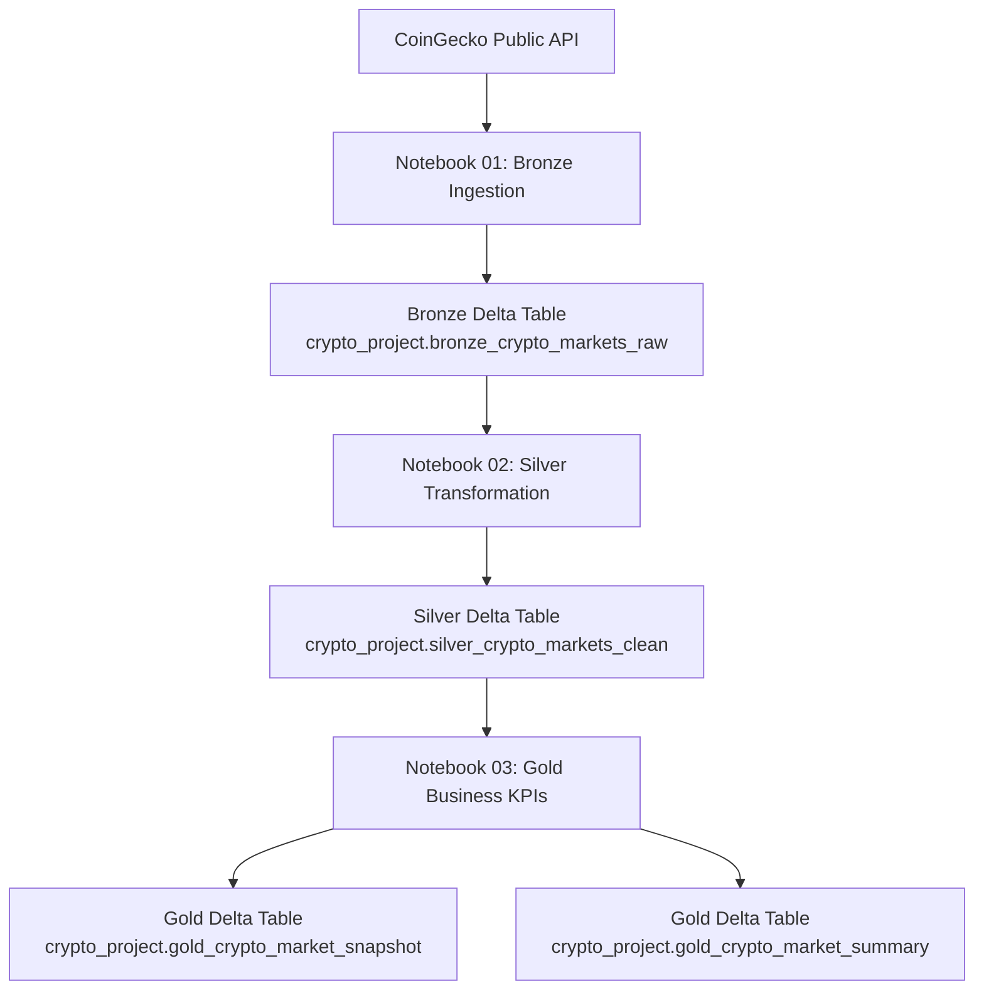
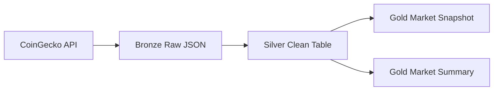

# Architecture Documentation — Crypto Market Analytics Platform

## 1. Purpose of This Document

This document explains the technical architecture of the **Crypto Market Analytics Platform**, a data engineering project built with **Databricks Free Edition**, **Apache Spark**, **PySpark**, **Spark SQL**, and **Delta Lake**.

The project follows the **Medallion Architecture**, organizing the data pipeline into three layers:

```text
Bronze → Silver → Gold
```

Each layer has a clear responsibility, making the pipeline easier to maintain, debug, scale, and explain.

---

## 2. High-Level Architecture

The pipeline ingests cryptocurrency market data from the **CoinGecko Public API**, stores the raw data in a Bronze Delta table, transforms it into a clean Silver table, and creates business-ready Gold tables with analytical KPIs.



---

## 3. Architecture Goals

The main goals of this architecture are:

1. **Preserve raw source data**

   * The original API response is stored without transformation in the Bronze layer.

2. **Separate responsibilities**

   * Ingestion, cleaning, and business logic are handled in separate notebooks and layers.

3. **Enable traceability**

   * Metadata such as source system, API endpoint, ingestion timestamp, and processing timestamp is stored.

4. **Use reliable storage**

   * Delta Lake is used instead of plain CSV or JSON files.

5. **Create analytics-ready outputs**

   * Gold tables provide business KPIs ready for reporting, dashboards, or SQL analysis.

6. **Practice real-world data engineering patterns**

   * The project simulates how data pipelines are commonly structured in professional data platforms.

---

## 4. Data Source

The data source is the **CoinGecko Public API**.

Endpoint:

```text
https://api.coingecko.com/api/v3/coins/markets
```

The API returns market information for cryptocurrencies, including:

* Coin ID
* Symbol
* Name
* Current price
* Market capitalization
* Market cap rank
* Total volume
* 24-hour high and low prices
* 24-hour price change
* Supply metrics
* All-time high and low
* Last updated timestamp

The project retrieves the top 10 cryptocurrencies ordered by market capitalization.

---

## 5. Project Schema

All tables are created inside the following schema:

```text
crypto_project
```

Using a dedicated schema helps organize the project and avoid mixing project tables with unrelated tables.

Final tables:

```text
crypto_project.bronze_crypto_markets_raw
crypto_project.silver_crypto_markets_clean
crypto_project.gold_crypto_market_snapshot
crypto_project.gold_crypto_market_summary
```

---

## 6. Bronze Layer

## 6.1 Purpose

The Bronze layer is responsible for raw ingestion.

It stores data exactly as it arrives from the source system. No business transformation, cleaning, or KPI calculation should happen in this layer.

Bronze acts as the landing zone and historical evidence of what was received from the API.

---

## 6.2 Bronze Table

```text
crypto_project.bronze_crypto_markets_raw
```

---

## 6.3 Main Responsibilities

The Bronze notebook performs the following tasks:

1. Calls the CoinGecko API.
2. Receives the JSON response.
3. Stores each coin response as raw JSON.
4. Adds ingestion metadata.
5. Writes the result to a Delta table.

---

## 6.4 Bronze Columns

| Column          | Description                          |
| --------------- | ------------------------------------ |
| `coin_id`       | Coin identifier from the API         |
| `symbol`        | Coin symbol                          |
| `raw_json`      | Full raw JSON response               |
| `source_system` | Source system name                   |
| `api_endpoint`  | API endpoint used                    |
| `ingestion_ts`  | Timestamp when the data was ingested |

---

## 6.5 Why Store Raw JSON?

The raw JSON is stored to preserve the original source data.

This is important because if a transformation error is discovered later in Silver or Gold, the pipeline can be reprocessed from the original Bronze data.

Without Bronze, the original data could be lost after transformation.

---

## 6.6 Bronze Write Mode

The Bronze table uses `append` mode.

```python
bronze_df.write \
    .format("delta") \
    .mode("append") \
    .saveAsTable("crypto_project.bronze_crypto_markets_raw")
```

### Why Append?

Each Bronze execution represents a new ingestion batch.

Appending allows the pipeline to keep historical raw data instead of replacing previous ingestions.

This is useful for:

* Auditing
* Debugging
* Historical analysis
* Reprocessing
* Data lineage

---

## 7. Silver Layer

## 7.1 Purpose

The Silver layer is responsible for transforming raw data into clean, structured, and typed data.

Silver reads from Bronze, parses the raw JSON, extracts the required fields, converts data types, and prepares the data for analytical use.

---

## 7.2 Silver Table

```text
crypto_project.silver_crypto_markets_clean
```

---

## 7.3 Main Responsibilities

The Silver notebook performs the following tasks:

1. Reads from the Bronze Delta table.
2. Parses the `raw_json` column.
3. Applies an explicit schema.
4. Extracts useful attributes into columns.
5. Converts timestamps and numeric values.
6. Adds a Silver processing timestamp.
7. Writes the clean data to a Delta table.

---

## 7.4 Silver Columns

| Column                             | Description                                        |
| ---------------------------------- | -------------------------------------------------- |
| `coin_id`                          | Coin identifier                                    |
| `symbol`                           | Coin symbol                                        |
| `coin_name`                        | Coin name                                          |
| `current_price_usd`                | Current price in USD                               |
| `market_cap_usd`                   | Market capitalization in USD                       |
| `market_cap_rank`                  | Ranking by market capitalization                   |
| `total_volume_usd`                 | Total trading volume in USD                        |
| `high_24h_usd`                     | Highest price in the last 24 hours                 |
| `low_24h_usd`                      | Lowest price in the last 24 hours                  |
| `price_change_24h_usd`             | Price change in the last 24 hours                  |
| `price_change_percentage_24h`      | Price change percentage in the last 24 hours       |
| `market_cap_change_24h_usd`        | Market cap change in USD                           |
| `market_cap_change_percentage_24h` | Market cap change percentage                       |
| `circulating_supply`               | Current circulating supply                         |
| `total_supply`                     | Total supply                                       |
| `max_supply`                       | Maximum supply, if reported                        |
| `all_time_high_usd`                | All-time high price                                |
| `all_time_high_date`               | All-time high timestamp                            |
| `all_time_low_usd`                 | All-time low price                                 |
| `all_time_low_date`                | All-time low timestamp                             |
| `last_updated_ts`                  | Last updated timestamp from the API                |
| `source_system`                    | Source system name                                 |
| `api_endpoint`                     | API endpoint used                                  |
| `ingestion_ts`                     | Original Bronze ingestion timestamp                |
| `silver_processed_ts`              | Timestamp when the Silver layer processed the data |

---

## 7.5 Why Use an Explicit Schema?

An explicit schema makes the transformation more reliable.

Spark needs to know the correct data types for each field. For example:

```text
current_price_usd → Double
market_cap_usd → Double
market_cap_rank → Long
last_updated_ts → Timestamp
```

Using proper data types allows the project to calculate metrics, sort values, compare numbers, and run SQL analytics correctly.

---

## 7.6 Handling Null Values

Some fields may contain `null` values.

For example, not all cryptocurrencies have a reported maximum supply. This means that a `null` value in `max_supply` is not always an error. In some cases, it represents valid business information.

The Silver layer preserves these values so that the Gold layer can classify them properly.

---

## 7.7 Silver Write Mode

The Silver table uses `overwrite` mode.

```python
silver_df.write \
    .format("delta") \
    .mode("overwrite") \
    .option("overwriteSchema", "true") \
    .saveAsTable("crypto_project.silver_crypto_markets_clean")
```

### Why Overwrite?

Silver is a derived layer.

If the parsing logic, schema, or cleaning rules change, the Silver table can be rebuilt from Bronze.

Using `overwrite` avoids duplicate processed records when re-running the notebook.

---

## 8. Gold Layer

## 8.1 Purpose

The Gold layer is responsible for business-ready data.

Gold reads from Silver and creates metrics that can be used by analysts, dashboards, reports, and decision-makers.

This layer does not store raw data. It stores curated outputs and KPIs.

---

## 8.2 Gold Tables

```text
crypto_project.gold_crypto_market_snapshot
crypto_project.gold_crypto_market_summary
```

---

# 9. Gold Market Snapshot Table

## 9.1 Purpose

The market snapshot table contains one row per cryptocurrency with business KPIs calculated from the Silver data.

```text
crypto_project.gold_crypto_market_snapshot
```

---

## 9.2 Main KPIs

| KPI                          | Description                                              |
| ---------------------------- | -------------------------------------------------------- |
| `market_cap_share_top10_pct` | Market cap share of each coin within the analyzed top 10 |
| `volume_to_market_cap_pct`   | Trading volume compared to market capitalization         |
| `intraday_range_pct`         | 24h price range as percentage of current price           |
| `performance_signal`         | Positive, Neutral, or Negative 24h performance           |
| `volatility_bucket`          | Low, Medium, or High Volatility                          |
| `market_cap_tier`            | Business tier based on market cap rank                   |
| `supply_issued_pct`          | Percentage of maximum supply already issued              |
| `supply_status`              | Supply classification                                    |

---

## 9.3 KPI Logic

### Market Cap Share

```text
market_cap_share_top10_pct =
coin_market_cap / total_market_cap_of_top10 * 100
```

This metric shows how much each asset contributes to the total market cap of the analyzed top 10 coins.

Important note: this is not global crypto market dominance. It only represents the share within the top 10 assets retrieved by the pipeline.

---

### Volume to Market Cap Percentage

```text
volume_to_market_cap_pct =
total_volume_usd / market_cap_usd * 100
```

This metric gives an idea of relative trading activity compared to the size of the asset.

---

### Intraday Range Percentage

```text
intraday_range_pct =
(high_24h_usd - low_24h_usd) / current_price_usd * 100
```

This metric helps identify short-term price movement and volatility.

---

### Performance Signal

```text
Positive → price_change_percentage_24h >= 1
Negative → price_change_percentage_24h <= -1
Neutral  → between -1 and 1
```

This converts a numerical price change into a business-friendly category.

---

### Volatility Bucket

```text
High Volatility   → intraday_range_pct >= 5
Medium Volatility → intraday_range_pct >= 2
Low Volatility    → intraday_range_pct < 2
```

This makes it easier for business users to identify which assets are moving more aggressively during the day.

---

### Market Cap Tier

```text
Tier 1 - Market Leaders → rank <= 2
Tier 2 - Large Cap      → rank <= 5
Tier 3 - Top 10 Assets  → rank > 5
```

This groups assets based on their ranking position.

---

### Supply Status

```text
No max supply reported → max_supply is null
Almost fully issued    → supply_issued_pct >= 95
Mostly issued          → supply_issued_pct >= 70
Still expanding supply → supply_issued_pct < 70
```

This helps interpret whether an asset has a maximum supply and how much of that supply is already circulating.

---

# 10. Gold Market Summary Table

## 10.1 Purpose

The Gold summary table contains one row with executive-level metrics about the analyzed crypto market snapshot.

```text
crypto_project.gold_crypto_market_summary
```

---

## 10.2 Summary Metrics

| Metric                       | Description                                 |
| ---------------------------- | ------------------------------------------- |
| `coins_analyzed`             | Number of cryptocurrencies analyzed         |
| `total_market_cap_top10_usd` | Total market cap of the analyzed top 10     |
| `avg_price_change_24h_pct`   | Average 24h price change percentage         |
| `avg_intraday_range_pct`     | Average intraday range percentage           |
| `bitcoin_share_top10_pct`    | Bitcoin market cap share within the top 10  |
| `ethereum_share_top10_pct`   | Ethereum market cap share within the top 10 |
| `gold_processed_ts`          | Timestamp when Gold was processed           |

---

# 11. Data Lineage

The data lineage of this project is straightforward and traceable.



Lineage by table:

| Source        | Target        | Transformation                                   |
| ------------- | ------------- | ------------------------------------------------ |
| CoinGecko API | Bronze        | Raw API ingestion                                |
| Bronze        | Silver        | JSON parsing, type conversion, column extraction |
| Silver        | Gold Snapshot | KPI calculation and classification               |
| Silver        | Gold Summary  | Aggregation and executive summary                |

---

# 12. Notebook Responsibilities

| Notebook                         | Layer  | Responsibility                                  |
| -------------------------------- | ------ | ----------------------------------------------- |
| `01_bronze_ingestion.ipynb`      | Bronze | API ingestion and raw Delta storage             |
| `02_silver_transformation.ipynb` | Silver | JSON parsing, cleaning, typing, and structuring |
| `03_gold_business_kpis.ipynb`    | Gold   | KPI calculation and business-ready tables       |

---

# 13. Delta Lake Usage

Delta Lake is used as the storage format for all tables.

Delta provides features that are important in data engineering pipelines:

* ACID transactions
* Schema enforcement
* Version history
* Managed tables
* Reliable writes
* SQL support
* Integration with Spark DataFrames

---

## 13.1 Delta History

Delta Lake allows the project to inspect table history.

Example:

```sql
DESCRIBE HISTORY crypto_project.bronze_crypto_markets_raw;
```

This helps understand:

* When the table was written
* What operation was executed
* What version was created
* What metrics were recorded
* Who executed the operation

---

# 14. Validation Strategy

The project validates the pipeline by checking:

1. All expected tables exist.
2. The row counts match expectations.
3. Bronze contains raw JSON.
4. Silver contains clean structured columns.
5. Gold contains business KPIs.
6. Delta history is available.

---

## 14.1 Table Validation

```sql
SHOW TABLES IN crypto_project;
```

Expected result:

```text
bronze_crypto_markets_raw
silver_crypto_markets_clean
gold_crypto_market_snapshot
gold_crypto_market_summary
```

---

## 14.2 Record Count Validation

Expected record counts:

| Table                         | Expected Records |
| ----------------------------- | ---------------: |
| `bronze_crypto_markets_raw`   |               10 |
| `silver_crypto_markets_clean` |               10 |
| `gold_crypto_market_snapshot` |               10 |
| `gold_crypto_market_summary`  |                1 |

---

# 15. Screenshots

The following screenshots are stored in the `images/` directory.

Because this file is inside the `docs/` directory, image paths use `../images/`.

## Pipeline Tables


## Table Counts


## Bronze Layer


## Silver Layer


## Gold Market Snapshot


## Gold Market Summary


## Delta History


---

# 16. Operational Flow

The notebooks should be executed in the following order:

```text
1. 01_bronze_ingestion.ipynb
2. 02_silver_transformation.ipynb
3. 03_gold_business_kpis.ipynb
```

Execution dependency:

```text
Bronze must run before Silver.
Silver must run before Gold.
Gold depends on Silver being available and updated.
```

---

# 17. Current Limitations

This is an initial learning-focused version of the project.

Current limitations:

1. The pipeline is executed manually.
2. It only retrieves the top 10 cryptocurrencies.
3. It does not yet store multiple currencies.
4. There is no automated retry logic for API failures.
5. There are no formal data quality expectations.
6. There is no scheduled job workflow yet.
7. There is no dashboard yet.
8. There is no historical trend analysis yet.

---

# 18. How This Could Be Improved for Production

To make this architecture more production-ready, the following improvements could be added:

## 18.1 Scheduling

Use Databricks Workflows to schedule the pipeline.

Example:

```text
Bronze notebook → Silver notebook → Gold notebook
```

This would automate the pipeline execution.

---

## 18.2 Error Handling

Add stronger error handling around the API request:

* Retry logic
* Timeout handling
* HTTP status validation
* Logging failed requests
* Alerting on failures

---

## 18.3 Data Quality Checks

Add quality rules such as:

* `coin_id` must not be null.
* `symbol` must not be null.
* `market_cap_usd` must be greater than zero.
* `current_price_usd` must be greater than zero.
* `market_cap_rank` must be unique within a batch.

---

## 18.4 Historical Trend Analysis

Currently, the Gold layer is a snapshot.

A future version could preserve multiple snapshots over time and calculate trends such as:

* Price movement over days
* Market cap trend
* Volume trend
* Volatility trend
* Rank changes
* Bitcoin and Ethereum share trend

---

## 18.5 Dashboarding

A dashboard could be created using Databricks SQL to visualize:

* Top 10 market cap ranking
* Market cap share
* 24h performance
* Volatility buckets
* Relative liquidity
* Executive market summary

---

## 18.6 Incremental Processing

Future versions could process only new ingestion batches from Bronze instead of rebuilding Silver and Gold every time.

---

## 18.7 Governance and Lineage

Since Databricks Free Edition supports Unity Catalog concepts, future versions could include:

* Catalog organization
* Schema permissions
* Table ownership
* Data lineage
* Documentation of table definitions
* Governance rules

---

# 19. Interview Talking Points

This project can be explained in an interview as follows:

> I built a Databricks data engineering pipeline using the Medallion Architecture. The Bronze layer ingests raw cryptocurrency market data from the CoinGecko API and stores the original JSON response in Delta Lake with metadata. The Silver layer parses the raw JSON, applies an explicit schema, converts data types, and creates a clean analytical table. The Gold layer calculates business KPIs such as market cap share, relative volume, intraday volatility, performance signal, market cap tier, and supply status. I used Delta Lake for reliable storage, table history, and SQL-based analytics.

Important technical points to mention:

* Why Bronze stores raw JSON
* Why Silver applies schema and type conversion
* Why Gold contains business KPIs
* Why Delta Lake is better than CSV for this use case
* Why Bronze uses append
* Why Silver and Gold use overwrite
* How the pipeline can be moved toward production

---

# 20. Final Architecture Summary

The final architecture is:

```text
CoinGecko API
     |
     v
Bronze Delta Table
Raw JSON + ingestion metadata
     |
     v
Silver Delta Table
Cleaned, parsed, typed data
     |
     v
Gold Delta Tables
Business KPIs + executive summary
```

This architecture provides a clear separation between raw data, cleaned data, and business-ready data, which is one of the most important patterns in modern data engineering.

